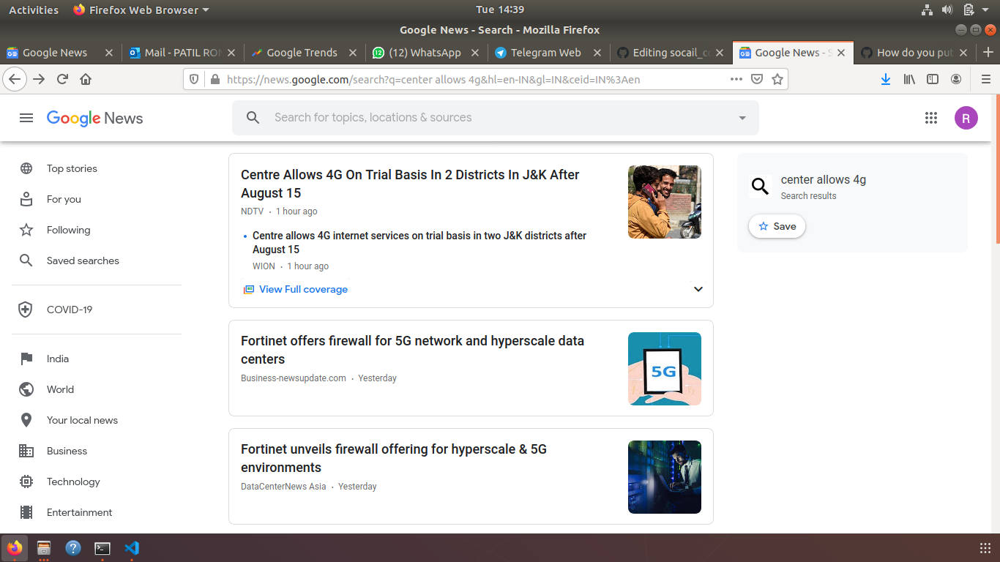
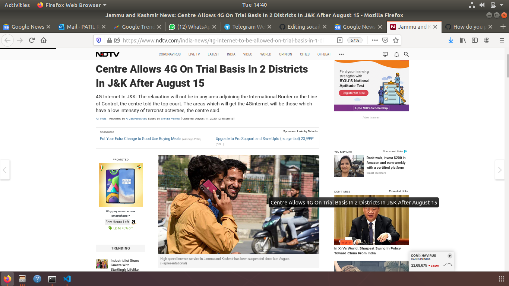
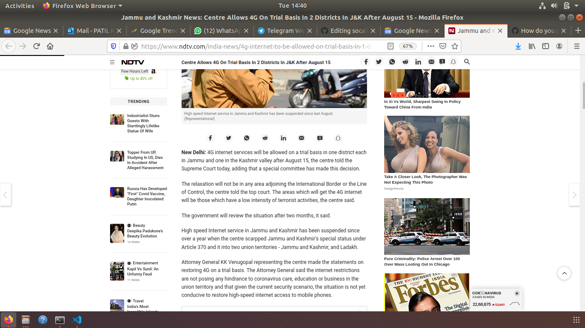
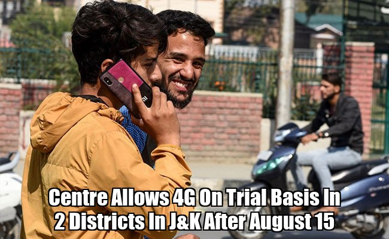

# socail_content_collector
creates a list of url from  google news of google trends . Then scraps  artical title ,text, keywords. genrates hashtags from this keywors and meta discription.  places article title  on artical image and  creates a message  from hashtags  and artical text . now sends  this processed image  and msg to urs telegram . now u ca share this image to socail media and also  now you have caption with hashtags . 

code is pretty much basic.

process :

 1)  choose from two options - google news or google trends
 2)  if - google news :
            script will scrap top headlines froms google news and  store this urls in a list
     if - google trends : 
           script will scrap top 20 current trends and store this urls in a list
 3) for each url in list  :
        scrap  artical  title, image , text ,meta keyword and keywords
        create new image from artical image and place artical title over it
        create a caption  from  artical text + (artical meta keywords and keywords  converted into hashtags)
        send this image and caption to telegram using bot token and chat id 
        
### you can make changes as you want is prettyeasy ,add new sources to genrate url , use any other socail platform discord etc , telegram is good thowgh

scprit tracked one of headline

scripts got url of source

processing iartical tile on artical image 

caption genrated  along with hashtags :
 *High speed Internet service in Jammu and Kashmir has been suspended since last August. (Representational)
4G internet services will be allowed on a trial basis in one district each in Jammu and one in the Kashmir valley after August 15, the centre told the Supreme Court today, adding that a special committee has made this decision.
The relaxation will not be in any area adjoining the International Border or the Line of Control, the centre told the top court. The areas which will get the 4G internet will be those which have a low intensity of terrorist activities, the centre said.
The government will review the situation after two months, it said.
High speed Internet service in Jammu and Kashmir has been suspended since over a year when the centre scarpped Jammu and Kashmir's special status under Article 370 and it into two union territories - Jammu and Kashmir, and Ladakh.
Attorney General KK Venugopal representing the centre made the statements on restoring 4G on a trial basis. The Attorney General said the internet restrictions are not posing any hindrance to coronavirus care, education or business in the union territory and that given the current security scenario, the situation is not yet conducive to restore high-speed internet access to mobile phones.
On Friday, the SupHigh speed Internet service in Jammu and Kashmir has been suspended since last August. (Representational)

4G internet services will be allowed on a trial basis in one district each in Jammu and one in the Kashmir valley after August 15, the centre told the Supreme Court today, adding that a special committee has made this decision.

The relaxation will not be in any area adjoining the International Border or the Line of Control, the centre told the top court. The areas which will get the 4G internet will be those which have a low intensity of terrorist activities, the centre said.

The government will review the situation after two months, it said.

High speed Internet service in Jammu and Kashmir has been suspended since over a year when the centre scarpped Jammu and Kashmir's special status under Article 370 and it into two union territories - Jammu and Kashmir, and Ladakh.

Attorney General KK Venugopal representing the centre made the statements on restoring 4G on a trial basis. The Attorney General said the internet restrictions are not posing any hindrance to coronavirus care, education or business in the union territory and that given the current security scenario, the situation is not yet conducive to restore high-speed internet access to mobile phones.

On Friday, the Supreme Court had asked the Jammu and Kashmir administration to explore the possibility of restoring 4G services in certain areas. A three-judge bench of Justices NV Ramana, R Subhash Reddy and BR Gavai heard the case today through video conferencing.

The Jammu and Kashmir administration sought time to take instructions on the restoration of high-speed internet service, saying a new Lieutenant Governor has been appointed in the union territory.

Manoj Sinha has been appointed the new Lt Governor of Jammu and Kashmir after GC Murmu resigned from the post.

The GC Murmu-led J&K administration has faced controversy over its opposition to restore 4G internet services in Jammu and Kashmir. It has cited increased terror activity as the reason behind its move in the Supreme Court in response to petitions seeking restoration of high-speed internet.

An NGO called Foundation for Media Professionals had approached the Supreme Court for contempt action against the Jammu and Kashmir administration and the centre for not implementing the top court's orders in restoring 4G internet services.15 #4G #4g #4ginternettoberestoredinJ&K #Centreallows4ginternetinJ&K #J&K4ginternetnews #JammuAndKashmirlatestnews #JammuandKashmir #Kashmirnews #SupremeCourt #administration #allows #basis #centre #court #districts #internet #jammu #jk #kashmir #services #supreme #trial #unionreme Court had asked the Jammu and Kashmir administration to explore the possibility of restoring 4G services in certain areas. A three-judge bench of Justices NV Ramana, R Subhash Reddy and BR Gavai heard the case today through video conferencing.
The Jammu and Kashmir administration sought time to take instructions on the restoration of high-speed internet service, saying a new Lieutenant Governor has been appointed in the union territory.
Manoj Sinha has been appointed the new Lt Governor of Jammu and Kashmir after GC Murmu resigned from the post.
The GC Murmu-led J&K administration has faced controversy over its opposition to restore 4G internet services in Jammu and Kashmir. It has cited increased terror activity as the reason behind its move in the Supreme Court in response to petitions seeking restoration of high-speed internet.
An NGO called Foundation for Media Professionals had approached the Supreme Court for contempt action against the Jammu and Kashmir administration and the centre for not implementing the top court's orders in restoring 4G internet services.15 #4G #4g #4ginternettoberestoredinJ&K #Centreallows4ginternetinJ&K #J&K4ginternetnews #JammuAndKashmirlatestnews #JammuandKashmir #Kashmirnews #SupremeCourt #administration #allows #basis #centre #court #districts #internet #jammu #jk #kashmir #services #supreme #trial #union*
